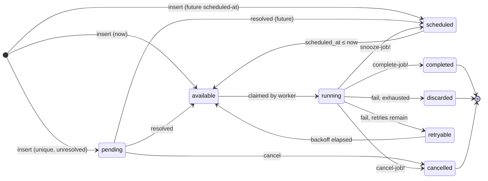

# Jobs

## Job record

Every job is returned as a Clojure map (defrecord) with these fields:

| Field | Type | Description |
|---|---|---|
| `:id` | long | Auto-assigned primary key |
| `:kind` | string | Job type identifier (matches registry key) |
| `:state` | keyword | Current state (see below) |
| `:args` | map | Decoded job arguments |
| `:queue` | string | Queue name (default `"default"`) |
| `:priority` | int | 1 (highest) to 4 (lowest) |
| `:attempt` | int | Number of times attempted (0-based; becomes 1 on first run) |
| `:max-attempts` | int | Maximum allowed attempts before discarding |
| `:scheduled-at` | Instant | When the job becomes eligible to run |
| `:created-at` | Instant | When the job was inserted |
| `:attempted-at` | Instant | When the last attempt started (nil if never run) |
| `:finalized-at` | Instant | When the job reached a terminal state (nil if active) |
| `:errors` | vector | Error entries from failed attempts `[{:error "..." :trace "..." :at "..."}]` |
| `:tags` | vector | Arbitrary string tags |
| `:metadata` | map | User-controlled metadata (string keys) |
| `:ephemeral` | boolean | If true, row is deleted immediately on successful completion |
| `:timeout` | long or nil | Per-job execution timeout in milliseconds (nil = use worker config) |
| `:ttl` | long or nil | Time-to-live in milliseconds; job is discarded if unstarted after `created_at + ttl_ms` (nil = no TTL) |

## Job states



States in the `:state` field are keywords: `:available`, `:running`, `:completed`, `:retryable`, `:discarded`, `:cancelled`, `:scheduled`, `:pending`.

Terminal states (job will not run again): `:completed`, `:discarded`, `:cancelled`.

## Inserting jobs

### Auto-transaction variant (most common)

```clojure
;; Minimal — kind and args only
(drip/insert-job client "send_email" {:to "user@example.com"})

;; With options as keyword args
(drip/insert-job client "send_email" {:to "user@example.com"}
  :queue       "notifications"
  :priority    2
  :max-attempts 3)

;; With options as a map
(drip/insert-job client "send_email" {:to "user@example.com"}
  {:queue "notifications" :priority 2})
```

Default values: `queue="default"`, `priority=1`, `max-attempts=25`.

### Explicit transaction variant

Use `insert-job!` (with `!`) when you need the insert to be atomic with other writes:

```clojure
(drip/with-tx [tx client]
  (create-user! tx user-data)
  (drip/insert-job! client tx "send_welcome" {:user-id (:id user-data)}))
```

If the transaction rolls back, the job is not created.

### All insert options

| Option | Type | Default | Description |
|---|---|---|---|
| `:queue` | string | `"default"` | Target queue |
| `:priority` | int 1–4 | `1` | Lower number = higher priority |
| `:max-attempts` | int | `25` | Max attempts before discarding |
| `:scheduled-at` | Instant | now | When job becomes available |
| `:tags` | vector of strings | `[]` | Arbitrary labels |
| `:metadata` | map | `{}` | User-controlled metadata (string keys) |
| `:unique-opts` | map | nil | Deduplication options (see below) |
| `:ephemeral` | boolean | `false` | Delete row immediately on successful completion (see below) |
| `:timeout` | duration or ms | nil | Per-job execution timeout; overrides worker `:job-timeouts` for this job (see below) |
| `:ttl` | duration or ms | nil | Time-to-live; job is discarded if still unstarted when `created_at + ttl_ms <= now` (see below) |

### Scheduled jobs

Insert a job that runs in the future:

```clojure
(drip/insert-job client "send_reminder" {:user-id 42}
  :scheduled-at (.plusSeconds (Instant/now) 3600))   ; run in 1 hour
```

The job enters `:scheduled` state and transitions to `:available` when `scheduled_at <= now`. The executor calls `promote-scheduled-jobs!` on each poll.

### Batch insertion

```clojure
;; Opens its own transaction
(drip/insert-many client
  [["send_email"  {:to "a@example.com"} nil]
   ["send_email"  {:to "b@example.com"} {:queue "bulk"}]
   ["log_event"   {:type "signup"} {:priority 4}]])

;; Within your own transaction
(drip/with-tx [tx client]
  (create-team! tx team-data)
  (drip/insert-many! client tx
    (mapv (fn [member]
            ["send_invite" {:email (:email member) :team-id (:id team-data)} nil])
          members)))
```

Each spec is a three-element vector: `[kind args opts]`. Pass `nil` for opts to use defaults.

### High-throughput batch insertion (PostgreSQL only)

For large volumes where you don't need deduplication or returned records:

```clojure
(with-open [conn (.getConnection ^javax.sql.DataSource (:ds client))]
  (drip/insert-many-fast! conn
    (mapv (fn [item] ["process_item" {:id (:id item)} nil]) items)))
;; Returns long — number of rows inserted
```

Uses PostgreSQL's `COPY FROM STDIN` protocol — significantly faster for thousands of jobs. Limitations:
- No `:unique-opts` deduplication
- Returns row count, not Job records
- PostgreSQL only

## Unique jobs

Prevent duplicate jobs using `:unique-opts`:

```clojure
(drip/insert-job client "generate_report" {:type "monthly"}
  :unique-opts
  {:by-args   true    ; distinguish by args content
   :by-period "24h"   ; one per 24-hour window
   :by-queue  true    ; scope to queue
   :by-state  job/default-unique-states})
```

The unique key is a SHA-256 hash of `kind`, `args`, `period`, and `queue` — depending on which dimensions are enabled. If another job with the same key exists in any of the specified states, the insert throws a constraint violation.

### Uniqueness dimensions

| Option | Type | Default | Effect |
|---|---|---|---|
| `:by-args` | boolean | `false` | Include full args content in key |
| `:by-keys` | collection of keywords | `nil` | Include only these args keys in key |
| `:by-period` | duration string or ms | `nil` | Floor epoch to period window |
| `:by-queue` | boolean | `true` | Include queue name in key |
| `:by-state` | set of state keywords | `job/default-unique-states` | States that block a duplicate insert |
| `:exclude-kind` | boolean | `false` | Omit job kind from key (cross-kind uniqueness) |

`:by-keys` takes precedence over `:by-args`. When set, only the specified keys are extracted from args and included in the hash — other fields are ignored. Keys are sorted before hashing so order in the collection doesn't matter:

```clojure
;; Only :customer-id matters for uniqueness — :trace-id and other fields are ignored
(drip/insert-job client "process_order" {:customer-id 42 :trace-id "abc-123"}
  :unique-opts {:by-keys [:customer-id]})

;; Conflicts — same :customer-id
(drip/insert-job client "process_order" {:customer-id 42 :trace-id "xyz-456"}
  :unique-opts {:by-keys [:customer-id]})

;; No conflict — different :customer-id
(drip/insert-job client "process_order" {:customer-id 99 :trace-id "abc-123"}
  :unique-opts {:by-keys [:customer-id]})
```

`:by-args` and `:by-keys` normalize map key order before hashing, so `{:a 1 :b 2}` and `{:b 2 :a 1}` produce the same key.

### Cross-kind uniqueness with `:exclude-kind`

By default the job kind is included in the unique key, so `"job_a"` and `"job_b"` with identical args never conflict. Set `:exclude-kind true` to omit the kind — useful when multiple job kinds represent the same logical operation and you want exactly one in the queue regardless of which kind:

```clojure
;; Both kinds share a uniqueness slot when exclude-kind is true
(drip/insert-job client "send_email_v1" {:user-id 42}
  :unique-opts {:by-args true :exclude-kind true})

;; Conflicts — same args, kind excluded from key
(drip/insert-job client "send_email_v2" {:user-id 42}
  :unique-opts {:by-args true :exclude-kind true})
;; => throws SQLException
```

### Default states and slot lifecycle

`job/default-unique-states` is `#{:available :pending :running :scheduled :retryable :completed}`. Notably, `:cancelled` and `:discarded` are **not** included.

The uniqueness slot is active only while the job is in one of the `:by-state` states. When the job leaves all covered states — by being cancelled, discarded, or exhausted — the slot is freed and an identical job can be inserted again:

```clojure
;; Insert unique job
(drip/insert-job client "sync" {} {:unique-opts {:by-args true}})

;; Conflicts while the original is alive in a covered state
(drip/insert-job client "sync" {} {:unique-opts {:by-args true}})
;; => throws SQLException

;; Cancel the original — slot freed
(drip/cancel-job client job-id)

;; Now succeeds
(drip/insert-job client "sync" {} {:unique-opts {:by-args true}})
```

To keep the slot occupied through cancellation or discard, include those states:

```clojure
{:by-state (conj job/default-unique-states :cancelled :discarded)}
```

### Handling the conflict

When a duplicate insert is blocked, drip throws a `clojure.lang.ExceptionInfo` with `:type :s-exp.drip/unique-conflict` in `ex-data`. The originating `java.sql.SQLException` is available via `ex-cause`:

```clojure
(try
  (drip/insert-job client "daily_summary" {} :unique-opts {:by-period "24h"})
  (catch clojure.lang.ExceptionInfo e
    (when (= :s-exp.drip/unique-conflict (:type (ex-data e)))
      (log/info "job already queued" (select-keys (ex-data e) [:kind :queue])))))
```

The `ex-data` map contains:

| Key | Description |
|---|---|
| `:type` | `:s-exp.drip/unique-conflict` |
| `:kind` | Job kind string |
| `:queue` | Queue name |
| `:unique-opts` | The `unique-opts` map passed to the insert |

Periodic jobs use unique constraints automatically — no manual handling needed.

## Ephemeral jobs

Ephemeral jobs are deleted from the database immediately upon successful completion instead of transitioning to `:completed`. Failures (retry, discard) behave normally — the row is only removed on success.

Use them for high-throughput fire-and-forget work where you don't need a completion audit trail and want to avoid accumulating `:completed` rows.

```clojure
(drip/insert-job client "process_event" {:id event-id}
  :ephemeral true)
```

The job's handler calls `complete-job!` as usual — the DELETE happens automatically inside `complete-job!`.

```clojure
(drip/start-worker!
  {:client   client
   :registry {"process_event"
              (fn [client job]
                (process! (:args job))
                (drip/complete-job client (:id job)))}})
```

Ephemeral status can also be set via `update-job!`:

```clojure
(drip/update-job client job-id {:ephemeral true})
```

## Per-job timeout

A job can override the worker's `:job-timeouts` config with a `:timeout` set at insert time. This is useful when the same kind sometimes needs a different timeout depending on the payload — for example, a report job that normally runs in 30 seconds but occasionally processes a large dataset:

```clojure
;; Worker config: 30s default for all jobs
(drip/start-worker!
  {:client client
   :registry registry
   :job-timeouts {:default "30s"}})

;; This specific job gets 5 minutes regardless of the worker config
(drip/insert-job client "generate_report" {:range "yearly" :customer-id 42}
  :timeout "5m")
```

The per-job `:timeout` takes full precedence. A job with no `:timeout` (nil) falls back to the worker's `:job-timeouts` lookup.

Values accept duration strings (`"30s"`, `"5m"`, `"2h"`) or raw milliseconds. The stored value is exposed as `:timeout` (long, milliseconds) on the job record.

```clojure
;; Retrieve stored timeout
(:timeout (drip/get-job client job-id))   ; => 300000 (ms) or nil
```

When exceeded, the job thread is interrupted and the job transitions to `:retryable` or `:discarded` (same as a handler exception), with a `"job timed out"` error recorded.

## Job TTL

A TTL (time-to-live) marks a job as stale after a fixed duration. If the job hasn't started (is still in `:available`, `:scheduled`, or `:retryable` state) when `created_at + ttl_ms <= now`, the maintenance worker discards it automatically.

```clojure
;; This job is meaningless more than 10 minutes after it was enqueued
(drip/insert-job client "send_push_notification" {:user-id 42 :msg "..."}
  :ttl "10m")
```

The TTL is stored as a duration in milliseconds. The expiry deadline is computed at query time as `created_at + ttl_ms`. It does not advance with retries — if a job is retried three times and still hasn't run, it will be expired based on the original insert time.

### Enabling TTL expiry in the maintenance worker

TTL jobs are only discarded when the maintenance worker runs its expiry sweep. Enable it with `:ttl-interval`:

```clojure
(drip/start-maintenance-worker!
  {:client       client
   :ttl-interval "1m"    ; check for expired jobs every minute
   ;; ...other options
   })
```

Without `:ttl-interval`, the `ttl_ms` column is stored but never acted on.

### TTL vs scheduling

| | `:scheduled-at` | `:ttl` |
|---|---|---|
| Purpose | Delay when a job *starts* | Expire a job if not started in time |
| Effect | Job waits in `:scheduled` state | Job discarded after deadline passes |
| Acts on | Future time | Duration from insert |

A job can have both: `scheduled_at` to delay its first eligibility, and a TTL to abandon it if it still hasn't run by a deadline.

### Behavior by state

| State at expiry time | Action |
|---|---|
| `:available` | Discarded |
| `:scheduled` | Discarded |
| `:retryable` | Discarded |
| `:running` | **Not affected** — running jobs are never expired |
| Already finalized | No-op |

### Inspecting TTL

The TTL is exposed as `:ttl` (long milliseconds or nil) on the job record:

```clojure
(:ttl (drip/get-job client job-id))   ; => 600000 (ms) or nil
```

## Querying jobs

### Single job

```clojure
(drip/get-job client job-id)   ; returns Job or nil
```

### Listing jobs

```clojure
;; By state
(drip/list-jobs client {:state :running})
(drip/list-jobs client {:states [:running :retryable]})

;; By kind
(drip/list-jobs client {:kind "send_email"})
(drip/list-jobs client {:kinds ["send_email" "send_sms"]})

;; By queue
(drip/list-jobs client {:queue "bulk"})
(drip/list-jobs client {:queues ["default" "bulk"]})

;; By priority
(drip/list-jobs client {:priorities [1 2]})

;; Time range
(drip/list-jobs client
  {:created-after  (.minusSeconds (Instant/now) 3600)
   :created-before (Instant/now)})

(drip/list-jobs client
  {:scheduled-after  (Instant/now)
   :scheduled-before (.plusDays (Instant/now) 7)})

;; Limit
(drip/list-jobs client {:limit 50})   ; default 100

;; Combine filters (all are AND)
(drip/list-jobs client
  {:state :retryable
   :kind  "send_email"
   :queue "notifications"
   :limit 25})
```

### Cursor pagination

Jobs are returned in descending ID order. Use `:after` for the next page:

```clojure
(def page-1 (drip/list-jobs client {:limit 50}))
(def page-2 (drip/list-jobs client {:limit 50 :after (:id (last page-1))}))
```

## Modifying jobs

### Update writable fields

```clojure
(drip/update-job client job-id
  {:priority     2
   :queue        "urgent"
   :max-attempts 10
   :tags         ["vip" "retry"]
   :metadata     {:reason "reprioritized"}})
```

Setting `:scheduled-at` also transitions state:
- Future instant → `:scheduled`
- Past/present instant → `:available`

```clojure
(drip/update-job client job-id
  {:scheduled-at (.plusHours (Instant/now) 2)})   ; → :scheduled
```

Setting `:state` directly is allowed for `:available`, `:scheduled`, `:cancelled`, `:discarded` only.

### State transitions

```clojure
;; Force back to :available (resets nothing — attempt count is preserved)
(drip/retry-job client job-id)

;; Cancel (only non-finalized jobs)
(drip/cancel-job client job-id)

;; Move to :discarded
(drip/discard-job client job-id)

;; Mark :completed
(drip/complete-job client job-id)

;; Reschedule without consuming a retry (must be :running)
(drip/snooze-job client job-id "30m")   ; or ms: (drip/snooze-job client job-id 1800000)
```

All have `!` tx-taking variants: `retry-job!`, `cancel-job!`, `discard-job!`, `complete-job!`, `snooze-job!`.

### Job output

Store a result in the job record for later retrieval:

```clojure
;; In a handler
(drip/record-output! client tx job-id {:rows-processed 1042 :status "ok"})

;; Retrieve after completion
(get-in (drip/get-job client job-id) [:metadata "output"])
;; => {"rows-processed" 1042 "status" "ok"}
```

Note metadata keys are strings (not keywords) — this matches River's convention and avoids lossy round-trips with arbitrary user-controlled keys.

## Deleting jobs

```clojure
;; Hard-delete single job by ID
(drip/delete-job client job-id)   ; returns deleted Job or nil

;; Bulk delete by criteria
(drip/delete-jobs client {:states [:completed :cancelled]
                           :finalized-before (.minusDays (Instant/now) 7)})

;; More filters
(drip/delete-jobs client {:states         [:discarded]
                           :kinds          ["old_type"]
                           :queues         ["legacy"]
                           :priorities     [4]
                           :created-before (.minusDays (Instant/now) 30)})
```

`:states` is required for `delete-jobs`. Returns count of deleted rows.

The executor performs automatic retention cleanup (see [Workers](03-workers.md#retention)).

## Rescuing stuck jobs

Jobs can get stuck in `:running` if a worker crashes before completing them. The executor rescues stuck jobs automatically, but you can also call it manually:

```clojure
(drip/rescue-stuck-jobs client
  (.minusSeconds (Instant/now) 3600)   ; stuck-after: Instant
  drip/default-retry-policy)
```

Jobs with `attempted_at <= stuck-after` are moved to `:retryable` (or `:discarded` if exhausted). Each gets an error entry with `"job rescued after timeout"`.
